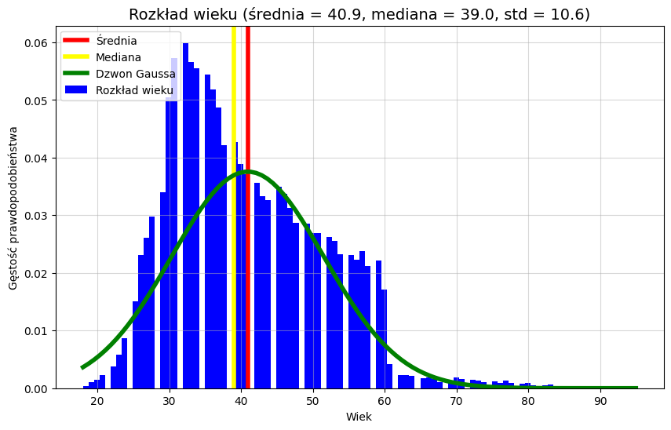
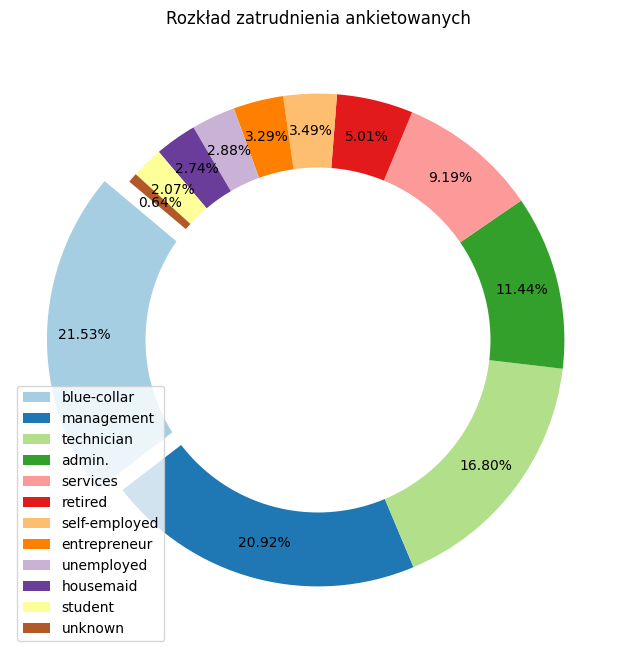
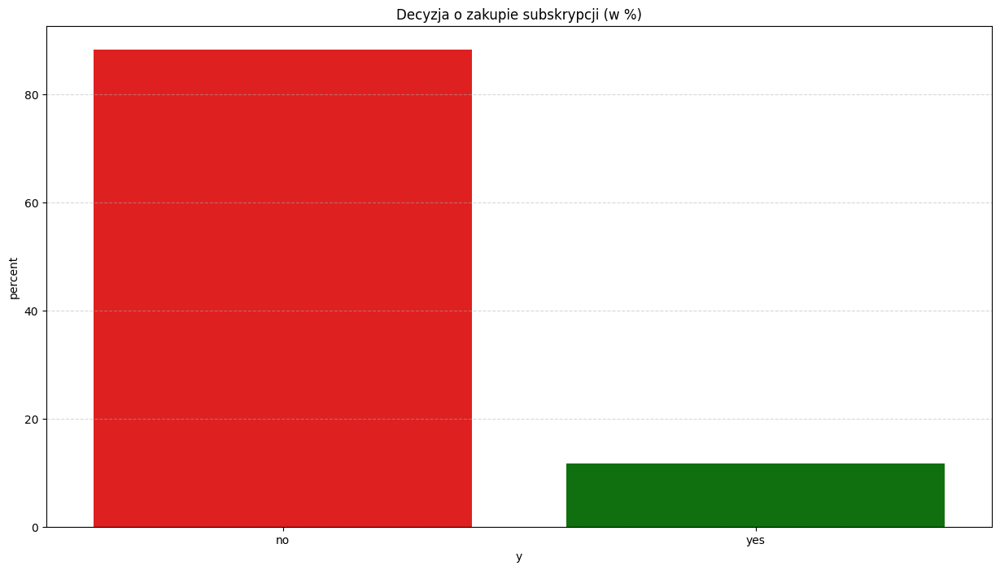
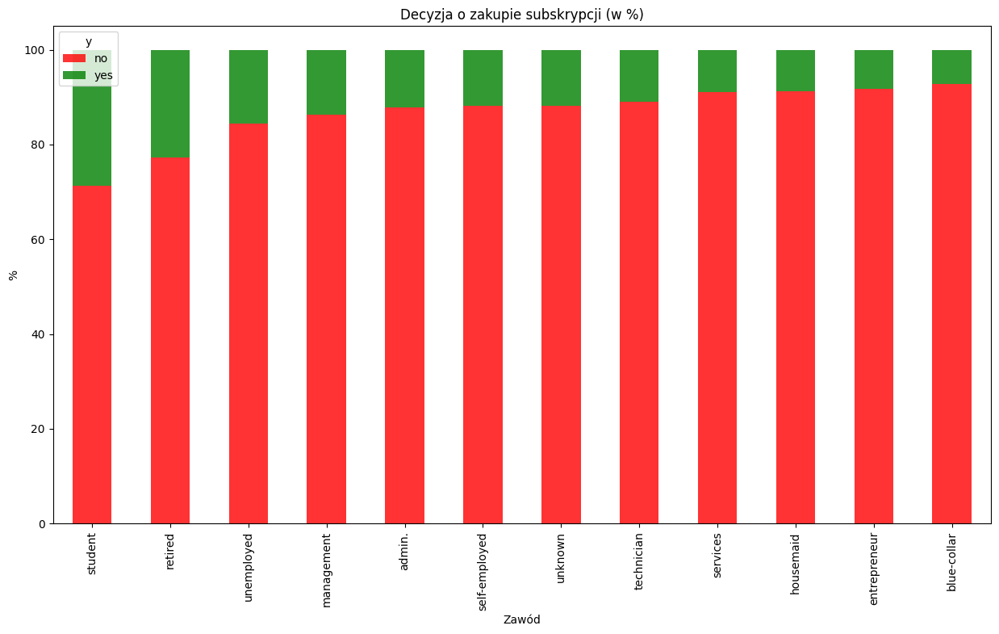
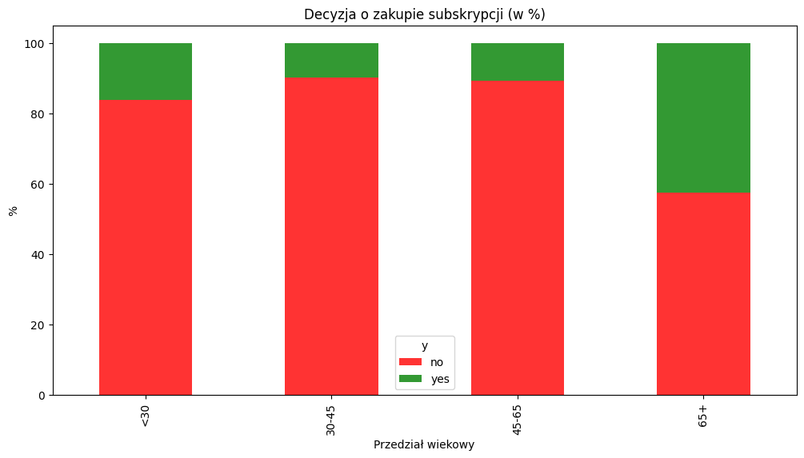
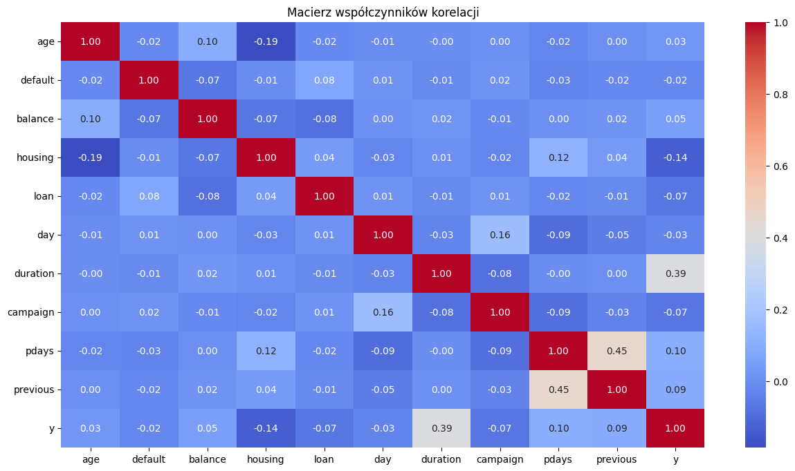

# Raport BI: Lokaty terminowe – optymalizacja kampanii banku
**Autor: Dawid Wysokiński**

---

## 1. Problem biznesowy
Bank XYZ chce zwiększyć efektywność sprzedaży subskrypcji lokat terminowych. W tym celu zlecił nam analizę bazy klientów, która zawiera informację o **45 211 klientach**. Podjęto decyzję o jej przeprowadzeniu w celu określenia, czy możliwe jest stworzenie modelu przewidującego, czy dany klient zdecyduje się na zakup subskrypcji lokaty terminowej w przypadku przedstawienia oferty na podstawie danych historycznych.

## 2. Cel
Głównym celem jest **ocena wykonalności**, która ma określić, które cechy dostępne w bazie danych klientów banku najbardziej wpływają na założenie lokaty terminowej, a także określić, jaki rodzaj modelu w zastosowaniu bankowym sprawdzi się lepiej.

## 3. Metodyka
Analiza została zrealizowana przy użyciu środowiska **Python** (biblioteki Pandas, Scikit-learn oraz biblioteki wizualizacyjne) w następujących krokach:
1. **EDA** – określenie profilu klientów banku.
2. **Przygotowanie danych**.
3. **Modelowanie** – Regresja Logistyczna oraz Sieci Neuronowe (MLP).
4. **Ocena i rekomendacja biznesowa**.

## 4. EDA – profil klientów
Analiza dostarczonych danych pozwoliła zbudować profile klientów, a także określić ogólne ich cechy jako grupy.

### Struktura wieku:
Rozkład średniego wieku ankietowanych (klientów banku, którym została przedstawiona oferta lokaty terminowej) jest prawoskośny. Większość ankietowanych klientów znajduje się w przedziale wiekowym od 30 do 50 lat. Średni wiek ankietowanych wynosi około **41 lat**, a mediana **39 lat**. Oznacza to, że nieliczna grupa starszych ankietowanych klientów lekko zawyża średnią.



### Struktura zawodowa:
Pracownicy fizyczni (*blue-collar*) oraz kadra zarządzająca (*management*) stanowią dominującą grupę ankietowanych. Najmniejszą grupę stanowią studenci. W przypadku 0,64% ankietowanych klientów zatrudnienie jest nieznane.



### Analiza konwersji:
Wskaźnik konwersji, czyli odsetek zgód na subskrypcję wśród ankietowanych, wyniósł **11,70%**. Oznacza to, że pozytywną odpowiedź wyrażała średnio co dziewiąta lub dziesiąta ankietowana osoba.



Grupy o najwyższym współczynniku konwersji to **studenci oraz emeryci** (przekraczający 20% zgód). Na trzecim miejscu znajdują się osoby bezrobotne. Najniższą skłonność do zakupu subskrypcji wykazują pracownicy fizyczni (*blue-collar*) stanowiący najliczniejszą ankietowaną grupę.



Wraz ze wzrostem wieku ankietowanych wzrasta ich współczynnik konwersji. Praktycznie co 2 osoba w wieku powyżej 65 lat decyduje się na ofertę. Drugą grupą o podwyższonym współczynniku konwersji są osoby poniżej 30 roku życia.



## 5. Modelowanie
Podczas przygotowania danych do modelowania nie zidentyfikowano silnych korelacji pomiędzy zmiennymi a decyzją. Jedną z wybijających się cech jest posiadanie przez ankietowanego kredytu hipotecznego, który **zmniejsza** szansę konwersji.



Zidentyfikowano **wyciek danych (*Data Leakage*)** w zmiennej `duration` (czas trwania rozmowy). Cecha ta nie jest dostępna przed wykonaniem połączenia przedstawiającego ofertę; model musi przewidywać wynik przed wykonaniem połączenia, aby bank mógł podjąć decyzję, któremu klientowi przedstawić ofertę, a któremu nie.

## 6. Strategie modelowania

| Cecha | Wariant A: Regresja Logistyczna | Wariant B: Sieć Neuronowa (MLP) |
| :--- | :--- | :--- |
| **Recall** | Model wyłapuje większość chętnych (**0.62**). | Bank traci 72% potencjalnych klientów (**0.28**). |
| **Precyzja** | (**0.23**) oznacza wiele telefonów do klientów niezainteresowanych. | (**0.55**) Większość telefonów kończy się sukcesem. |
| **Charakter** | Cechy możliwe do interpretacji. | Czarna skrzynka – brak znajomości powodu decyzji. |
| **Koszt** | Wyższy (większa liczba połączeń). | Niższy. |

Wariant A pozwolił na identyfikację najważniejszych cech, które zwiększają oraz zmniejszają szansę konwersji klienta:

* **Wagi Pozytywne:**
    * `poutcome_success`: klient, który wcześniej zdecydował się na ofertę, z dużym prawdopodobieństwem zrobi to ponownie.
    * `month_mar`, `month_oct`: miesiące, w których klienci częściej decydują się na założenie lokaty.
    * `job_retired`, `job_student`: emeryci i studenci są najlepszą grupą docelową.
    * `education_tertiary`: wyższe wykształcenie sprzyja pozytywnej decyzji.
* **Wagi Ujemne:**
    * `month_jan`, `month_nov`: okresy po- i przedświąteczne to najgorszy czas na ofertowanie.
    * `housing_yes`, `loan_yes`: posiadanie kredytów znacząco obniża szansę na lokatę.

## 7. Analiza SWOT
* **Mocne strony:** Automatyczne wytypowanie potencjalnych klientów; zmniejszenie ilości niepotrzebnych połączeń.
* **Słabe strony:** Niska precyzja modeli pozostawia nadal pewną ilość zbędnych telefonów.
* **Szanse:** Możliwość personalizacji oferty pod klientów o wysokiej konwersji (Seniorzy i Studenci).
* **Zagrożenia:** Czynniki zewnętrzne (geopolityka, rynek) nieuwzględnione w danych historycznych.

## 8. Rekomendacja końcowa
Wprowadzenie rozwiązania jest możliwe. Rekomenduje się **Wariant A: Regresja Logistyczna**. Model ten jest w pełni interpretowalny, co jest kluczowe w sektorze bankowym. Pomimo mniejszej precyzji niż MLP, wyłapuje większą liczbę chętnych (Recall), co przełoży się na większy wolumen sprzedaży. Wariant B (MLP) spowodowałby utratę aż 72% potencjalnych klientów i uniemożliwiłby uzasadnienie decyzji modelu.

---
**Załączniki:**
* [Repozytorium i kod źródłowy](https://github.com/dawidwys31/analiza_subskrypcji)
### Organizacja Projektu (CCDS)
```text
├── README.md          <- Raport
├── data
│   ├── processed      <- Dane przetworzone
│   └── raw            <- Dane oryginalne
├── notebooks          <- Jupyter Notebooks z kodem analizy
├── reports
│   └── figures        <- Wygenerowane wykresy
└── src                <- Kod źródłowy projektu