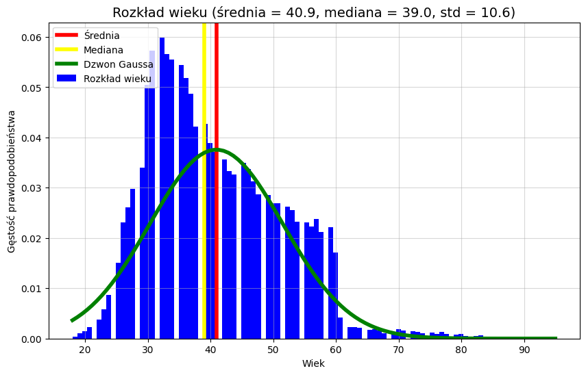
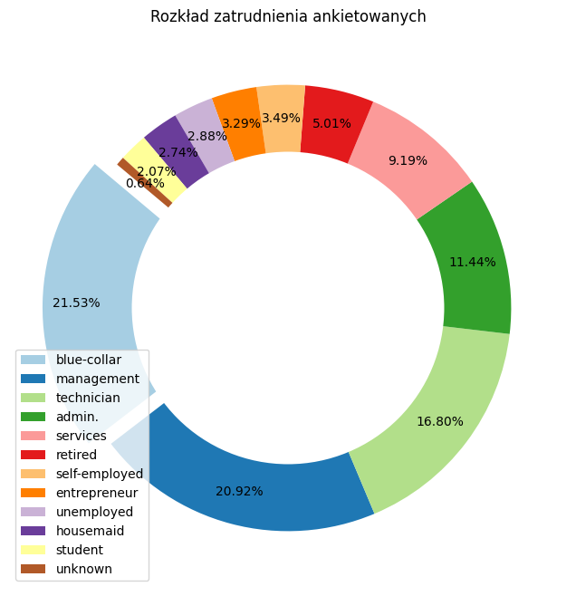
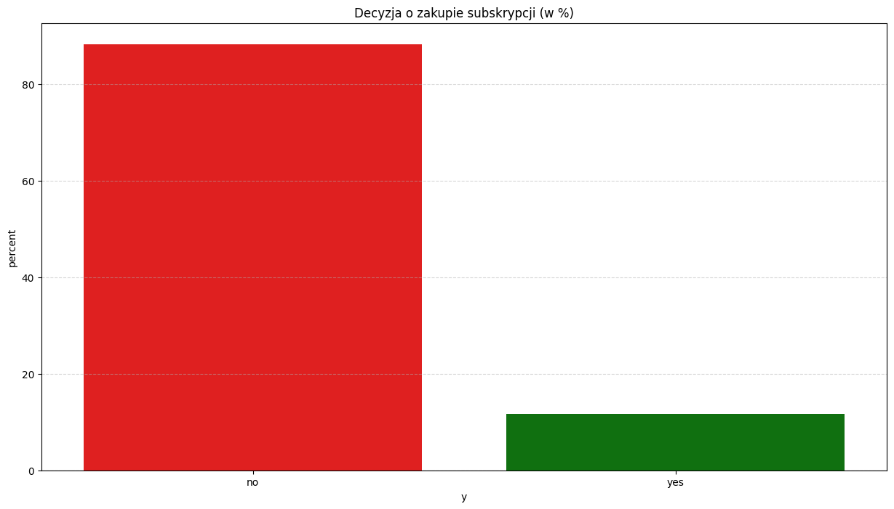
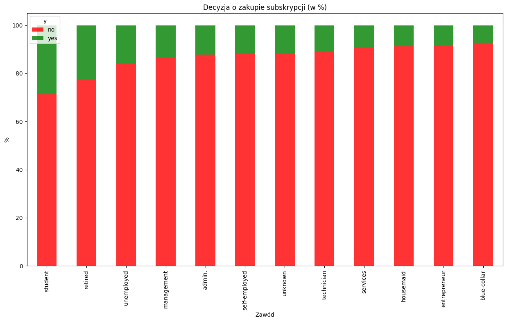
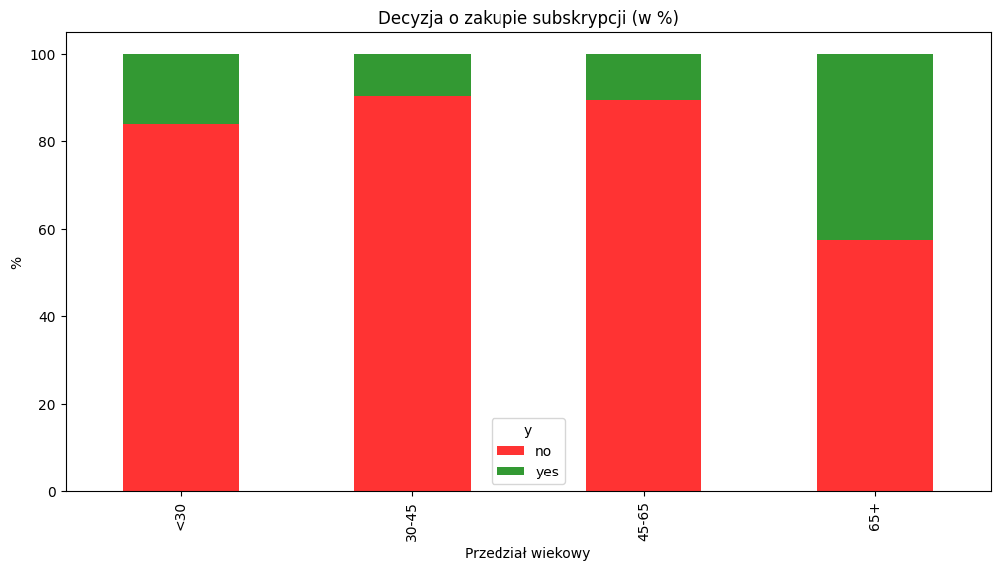
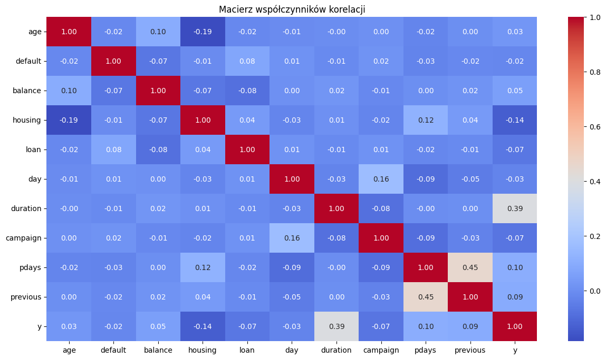

# Raport BI: Lokaty terminowe – optymalizacja kampanii banku
**https://github.com/dawidwys31/analiza_subskrypcji**

---

## 1. Problem biznesowy
Bank XYZ **chce** zwiększyć efektywność sprzedaży subskrypcji lokat terminowych. W tym celu zlecił nam analizę bazy klientów, która zawiera **informacje** o **45 211 klientach**. Podjęto decyzję o jej przeprowadzeniu w celu określenia, czy możliwe jest **stworzenie** modelu przewidującego, czy dany klient **zdecyduje** się na zakup subskrypcji lokaty terminowej w przypadku przedstawienia oferty na podstawie danych historycznych.

## 2. Cel
Głównym celem jest **ocena wykonalności**, która ma określić, które cechy dostępne w bazie danych klientów banku najbardziej wpływają na założenie lokaty terminowej, a także określić, jaki rodzaj modelu w zastosowaniu bankowym sprawdzi się lepiej.

## 3. Metodyka
Analiza została zrealizowana przy użyciu środowiska **Python** (biblioteki Pandas, Scikit-learn oraz biblioteki wizualizacyjne) w następujących krokach:
1. **EDA** – określenie profilu klientów banku.
2. **Przygotowanie danych**.
3. **Modelowanie** – Regresja Logistyczna oraz Sieci Neuronowe (MLP).
4. **Ocena i rekomendacja biznesowa**.

## 4. EDA – profil klientów
Analiza dostarczonych danych pozwoliła zbudować profile klientów, a także określić ogólne ich cechy jako grupy.

### Struktura wieku
Rozkład wieku (średnia $= 40.9$, mediana $= 39.0$, $std = 10.6$). Rozkład średniego wieku ankietowanych (klientów banku, którym została przedstawiona oferta lokaty terminowej) jest prawoskośny. Większość ankietowanych klientów **znajduje** się w przedziale wiekowym od 30 do 50 lat. Średni wiek ankietowanych wynosi około **41 lat**, a mediana **39 lat**. Oznacza to, że nieliczna grupa starszych ankietowanych klientów lekko zawyża średnią.



### Struktura zawodowa
Pracownicy fizyczni (*blue-collar*) oraz kadra zarządzająca (*management*) stanowią dominującą grupę ankietowanych. Najmniejszą grupę stanowią studenci. W przypadku **0.64%** ankietowanych klientów zatrudnienie jest nieznane.



### Analiza konwersji
Wskaźnik konwersji, czyli odsetek zgód na subskrypcję wśród ankietowanych, wyniósł **11.70%**. Oznacza to, że pozytywną odpowiedź wyrażała średnio co dziewiąta lub dziesiąta ankietowana osoba.





* **Najwyższa konwersja:** studenci oraz emeryci (przekraczający 20% zgód). Na trzecim miejscu znajdują się osoby bezrobotne.
* **Najniższa konwersja:** pracownicy fizyczni (*blue-collar*) stanowiący najliczniejszą ankietowaną grupę.

Wraz ze wzrostem wieku ankietowanych wzrasta ich współczynnik konwersji. Praktycznie co 2. osoba w wieku powyżej 65 lat decyduje się na ofertę. Drugą grupą o podwyższonym współczynniku konwersji są osoby poniżej 30. roku życia. Osoby w przedziale wiekowym od 30–45 lat oraz 45–65 wyróżniają się najniższym współczynnikiem konwersji.

| Cecha | Wysoka konwersja | Niska konwersja |
| :--- | :--- | :--- |
| **Wiek** | Mniej niż 30 oraz więcej niż 65 lat | 30–65 lat |
| **Zawód** | Student, emeryt, bezrobotny | Pracownik fizyczny |
| **Kredyt** | Brak kredytów | Posiadanie kredytu hipotecznego |
| **Kontakt** | Sukces wcześniejszego kontaktu | Brak wcześniejszego kontaktu z sukcesem |

## 5. Przygotowanie danych do modelowania
Proces przygotowania danych wykazał wyciek danych (*Data Leakage*) w zmiennej `duration` (czas trwania rozmowy). Cecha ta nie jest dostępna przed wykonaniem połączenia przedstawiającego ofertę; model musi przewidywać wynik przed wykonaniem połączenia. W tym celu kolumna ta została usunięta ze zbioru danych.

Przygotowanie danych wykazało silne niezbalansowanie klas (tylko 11.7% konwersji). W modelach zastosowano parametr `class_weight='balanced'` w regresji logistycznej oraz `RandomOverSampler` w MLP. Dzięki temu model uczy się rozpoznawać cechy klientów decydujących się na lokatę, zamiast zgadywać najczęściej występującą odpowiedź.

Zastosowano *one-hot encoding* dla wartości tekstowych oraz **StandardScaler** dla Sieci Neuronowych MLP, aby wyrównać skalę danych (np. `balance` vs `age`). Zmienna docelowa została zamieniona na wartości binarne ($0/1$).

Podczas analizy nie zidentyfikowano silnych korelacji pomiędzy zmiennymi a decyzją, poza kredytem hipotecznym, który **zmniejsza** szansę konwersji. 



Dane podzielono na zbiór uczący i testowy w skali **80/20**.

## 6. Porównanie wyników i interpretacja metryk

### Macierze pomyłek

**Macierz pomyłek MLP:**

| | Przewidziane: 0 | Przewidziane: 1 |
| :--- | :---: | :---: |
| **Rzeczywiste: 0** | 7741 | 239 |
| **Rzeczywiste: 1** | 770 | 293 |

**Macierz pomyłek Regresji Logistycznej:**

| | Przewidziane: 0 | Przewidziane: 1 |
| :--- | :---: | :---: |
| **Rzeczywiste: 0** | 6163 | 1817 |
| **Rzeczywiste: 1** | 402 | 661 |

* **False Positive (FP):** Model błędnie przewiduje chęć zakupu. Koszt: niski (czas pracy konsultanta).
* **False Negative (FN):** Model pomija klienta chętnego. Koszt: wysoki (utrata zysku).

**Wniosek:** Model powinien minimalizować FN (posiadać większy **Recall**).

### Porównanie wariantów

| Cecha | Wariant A: Regresja Logistyczna | Wariant B: MLP | Interpretacja biznesowa |
| :--- | :--- | :--- | :--- |
| **Recall** | **0.62** | 0.28 | Regresja wyłapuje większość potencjalnych klientów. MLP pomija aż 72% z nich. |
| **Precyzja** | 0.23 | 0.55 | W Regresji co 4. telefon to sukces. W MLP co 2., ale dzwonimy rzadziej. |
| **Charakter** | Możliwe do interpretacji | Czarna skrzynka | W bankowości brak znajomości powodu decyzji nie jest pożądany. |
| **Koszt** | Wyższy | Niższy | Praca konsultanta jest relatywnie tania względem zysku z lokaty. |

**Rekomenduje się Wariant A**, ponieważ lepiej dzwonić do 10 osób niepotrzebnie, niż przegapić 5 realnie zainteresowanych klientów.

### Kluczowe cechy (Regresja)
* **Wagi Pozytywne:** sukces poprzedniej kampanii (`poutcome_success`), miesiące marzec/październik, emeryci i studenci, wyższe wykształcenie.
* **Wagi Ujemne:** miesiące styczeń/listopad, posiadanie kredytu hipotecznego lub gotówkowego (`housing_yes`, `loan_yes`).

## 7. Analiza SWOT
* **Mocne strony:** Automatyczne wytypowanie klientów, redukcja „ślepych” telefonów.
* **Słabe strony:** Niska precyzja modelu generuje nadal sporo zbędnych połączeń.
* **Szanse:** Personalizacja oferty pod seniorów i studentów.
* **Zagrożenia:** Czynniki zewnętrzne (geopolityka, rynek) nieuwzględnione w danych.

## 8. Rekomendacja końcowa
Wprowadzenie rozwiązania jest możliwe. Rekomenduje się **Wariant A: Regresja Logistyczna**. Jest on w pełni interpretowalny, co jest kluczowe w bankowości. Pomimo mniejszej precyzji, **wyłapuje** znacznie więcej chętnych (*Recall*), co przełoży się na większy wolumen sprzedaży lokat. Model MLP spowodowałby utratę 72% potencjalnych klientów i uniemożliwiłby uzasadnienie decyzji modelu.

---

### Organizacja Projektu (CCDS)
```text
├── README.md          <- Raport
├── data
│   ├── processed      <- Dane przetworzone
│   └── raw            <- Dane oryginalne
├── notebooks          <- Jupyter Notebooks z kodem analizy
├── reports
│   └── figures        <- Wygenerowane wykresy
└── src                <- Kod źródłowy